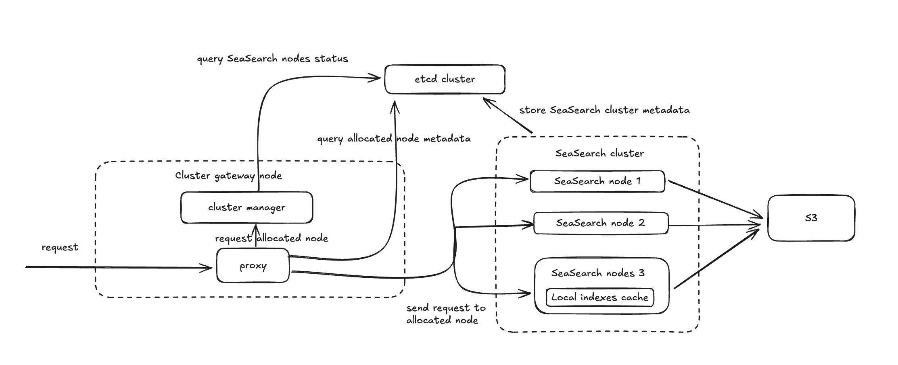
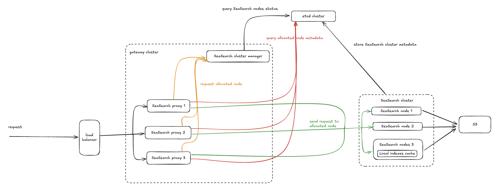

# Deploy SeaSearch in cluster (x86 CPU only)

## Cluster architecture

A SeaSearch cluster deployment consists of SeaSearch nodes (**recommended more than three nodes for high availability**), and gateway node(s). These nodes coordinate internal state and index allocation through etcd: 

- The SeaSearch node is responsible for reading and writing the index. The index is temporarily stored on the local disk as a cache. If the required data is not in the cache, it is read from S3. When a SeaSearch node goes offline, its indexes are reassigned to the remaining nodes, which then retrieve the latest data from S3.
- The gateway node mainly consists of two processes: the SeaSearch cluster-manager service and the SeaSearch proxy service. The former monitors the health of the Seasearch nodes and assigns the most suitable node to new requests. The latter queries etcd for the metadata information of the most suitable node assigned by the cluster-manager and uses this metadata information to forward user requests to that node.

## Prerequisite

### Prepare S3 storage for storing indexes

You need to create a bucket on S3 storage provider for storing indexes

### Prepare etcd cluster

You need to prepare [etcd](https://etcd.io/docs/v3.6/install/) cluster (**recommended more than three nodes for high availability**) to store SeaSearch cluster metadata information. In most cases, you can install and configure etcd for each node as follows:

- Installation:
    ```sh
    apt update
    apt install -y etcd-server etcd-client
    service etcd start


    mkdir /opt/etcd-data/
    chmod 777 /opt/etcd-data/
    ```
- Configuraion (`vim /etc/default/etcd`):
    ```conf
    # etcd-1 ip: 172.16.1.1
    # etcd-2 ip: 172.16.1.2
    # etcd-3 ip: 172.16.1.3

    ETCD_NAME="etcd-1"
    ETCD_DATA_DIR="/opt/etcd-data/"
    ETCD_LISTEN_PEER_URLS="http://172.16.1.1:2380"
    ETCD_LISTEN_CLIENT_URLS="http://localhost:2379,http://172.16.1.1:2379"
    ETCD_INITIAL_ADVERTISE_PEER_URLS="http://172.16.1.1:2380"
    ETCD_INITIAL_CLUSTER="etcd-1=http://172.16.1.1:2380,etcd-2=http://172.16.1.2:2380,etcd-3=http://172.16.1.3:2380"
    ETCD_INITIAL_CLUSTER_TOKEN="xxx" # your etcd token
    ETCD_ADVERTISE_CLIENT_URLS="http://localhost:2379,http://172.16.1.1:2379"
    ETCD_PROXY="off"
    ETCD_AUTO_COMPACTION_RETENTION="1"
    ```

    Then restart etcd with

    ```sh
    service etcd restart
    ```

    !!! tip "Timeout failure while restart etcd"
        This is usually because etcd is not yet installed on all etcd nodes (often happens while configuring a particular etcd node and etcd has not yet installed in some required nodes). You just need to wait until the configuration files (i.e., `/etc/default/etcd`) on all etcd nodes , and then restart the service togather.

## Deploy SeaSearch server (recommended more than three nodes)

The following assumptions and conventions are used in the rest of this document (applicable to **all nodes**, including the gateway nodes):

* `/opt/seasearch` is the directory for storing SeaSearch server docker compose files. If you decide to put SeaSearch in a different directory, adjust all paths accordingly.

* `/opt/seasearch-cluster-gateway` is the directory for storing SeaSearch gateway docker compose files. If you decide to put the gateway server in a different directory, adjust all paths accordingly.

### Download the yml and env file

You can download the `.yml` and `.env` files by following commands:

```bash
mkdir /opt/seasearch
cd /opt/seasearch
wget https://seasearch-manual.seafile.com/1.0/repo/cluster/seasearch/seasearch.yml
wget -O .env https://seasearch-manual.seafile.com/1.0/repo/cluster/seasearch/env
```

### Modify `.env` file

```env
INIT_SS_ADMIN_USER=<admin-username>  
INIT_SS_ADMIN_PASSWORD=<admin-password>
SS_CLUSTER_ID= # e.g., 1, 2, 3...., each node must be distinct and cannot be modified after initialization.
SS_ETCD_ENDPOINTS= # separated by commas, e.g., '192.168.0.1:2380,192.168.0.2:2380,192.168.0.3:2380'
SS_ETCD_USERNAME=
SS_ETCD_PASSWORD=
SS_ETCD_PREFIX=/seasearch
```

### Start SeaSearch server

```
docker compose up -d
```

## Deploy gateway

- Deployment method 1: single gateway (for most situations)

    In most cases, deploying just one gateway node is sufficient to handle user needs within a SeaSearch cluster. At this time, both the SeaSearch cluster-manager and SeaSearch proxy services on the gateway node are enabled:

    

- Deployment method 2: SeaSearch gateway cluster

    In addition to the main SeaSearch service, the SeaSearch gateway also supports clustering (i.e., ***SeaSearch gateway cluster***) to achieve load balancing for higher demand. The ***SeaSearch gateway cluster*** mainly consists of several SeaSearch proxy nodes (more than 3 are recommended for high availability) and one SeaSearch cluster manager node:

    

Regardless of the deployment method, you need to perform the following steps:

### Download the yml and env file

You can download the `.yml` and `.env` files by following commands:

```bash
mkdir /opt/seasearch-cluster-gateway
cd /opt/seasearch-cluster-gateway
wget https://seasearch-manual.seafile.com/1.0/repo/cluster/gateway/cluster-gateway.yml
wget -O .env https://seasearch-manual.seafile.com/1.0/repo/gateway/env
```

### Modify `.env` file

=== "Single gateway"

    ```env
    SS_ETCD_ENDPOINTS= # separated by commas, e.g., '192.168.0.1:2380,192.168.0.2:2380,192.168.0.3:2380'
    SS_ETCD_USERNAME=
    SS_ETCD_PASSWORD=
    SS_ETCD_PREFIX=/seasearch
    ```

=== "Gateway cluster"

    === "Cluster manager node (**only one node**)"

        ```env
        SS_GATEWAY_NODE_TYPE=manager # only start the cluster manager service

        SS_ETCD_ENDPOINTS= # separated by commas, e.g., '192.168.0.1:2380,192.168.0.2:2380,192.168.0.3:2380'
        SS_ETCD_USERNAME=
        SS_ETCD_PASSWORD=
        SS_ETCD_PREFIX=/seasearch
        ```
    
    === "Proxy node (> 3 nodes recommended)"

        ```env
        SS_GATEWAY_NODE_TYPE=proxy # only start the proxy service
        SS_CLUSTER_MANAGER_URL=http://<your_cluster_manager_node>:4081

        SS_ETCD_ENDPOINTS= # separated by commas, e.g., '192.168.0.1:2380,192.168.0.2:2380,192.168.0.3:2380'
        SS_ETCD_USERNAME=
        SS_ETCD_PASSWORD=
        SS_ETCD_PREFIX=/seasearch
        ```
    
    !!! tip "`SS_GATEWAY_NODE_TYPE` for Gateway cluster"
        When you set `SS_GATEWAY_NODE_TYPE=manager`, only the cluster-manager service will be started on the current gateway node (correspondingly, setting it to `proxy` will only start the proxy service). However, SeaSearch gateway cluster also supports users starting both the cluster manager and proxy services on a single gateway node to save resource overhead. In this case, you only need to set `SS_GATEWAY_NODE_TYPE` to empty.

### Start gateway node

=== "Single gateway"

   1. Start container

        ```sh
        docker compose up -d
        ```
    
    2. Register cluster

        ```sh
        # cluster_enpoints: "<CLUSTER_ID_1>:<SeaSearch server endpoint 1>,<CLUSTER_ID_2>:<SeaSearch server endpoint 2>"
        # e.g., "1:192.168.1.1:4080,2:192.168.1.2:4080,3:192.168.1.3:4080"
        docker exec -it seasearch-cluster-gateway register-cluster <cluster_enpoints>
        ```
    
    !!! tip "Proxy server will be started automatically after registering cluster"
        After registering cluster, the SeaSearch-proxy server will be started automatically after registering cluster if `register-cluster` command executed successfully.

=== "Gateway cluster"

    1. Start cluster mananger

        ```sh
        # in the node of deploying cluster mananger
        docker compose up -d
        ```
    
    2. Register cluster

        ```sh
        # cluster_enpoints: "<CLUSTER_ID_1>:<SeaSearch server endpoint 1>,<CLUSTER_ID_2>:<SeaSearch server endpoint 2>"
        # e.g., "1:192.168.1.1:4080,2:192.168.1.2:4080,3:192.168.1.3:4080"
        docker exec -it seasearch-cluster-gateway register-cluster <cluster_enpoints>
        ```
    
    3. Start SeaSearch-proxy

        ```sh
        # in the node of deploying SeaSearch-proxy
        docker compose up -d
        ```
    
!!! tip "Cluster change"
    If your SeaSearch cluster information has changed (e.g., a new SeaSearch node has been added), you need to do the following operations:

    1. Re-register cluster:

        ```sh
        docker exec -it seasearch-cluster-gateway register-cluster <new_cluster_enpoints>
        ```
    
    2. Restart SeaSearch-proxy server in all SeaSearch-proxy nodes (gateway cluster mode only):

        ```sh
        # in the node of deploying SeaSearch-proxy
        docker compose restart seasearch-cluster-gateway
        ```


Now, you can access SeaSearch API (console is unavailable) at `http://<your cluster-gateway IP>:4082/` (i.e., the URL of SeaSearch proxy, and refer to [here](#external-load-balancer-for-seasearch-gateway-cluster) for the situation with gateway cluster) and login by the `INIT_SS_ADMIN_USER` and `INIT_SS_ADMIN_PASSWORD` defined in the `.env` file.

### External load balancer for SeaSearch gateway cluster

Since the access endpoint for the SeaSearch cluster is the address of the proxy service in the gateway, you also need to configure load balancing for multiple proxy services to enable external connections for the SeaSearch gateway cluster. Here, we will use Nginx as an example to briefly describe how to configure Nginx to access the SeaSearch gateway cluster in this scenario:

```conf
upstream seasearch_proxy_backend {
    keepalive 32;
    
    server <seasearch-gateway-proxy-node1-ip>:4082 weight=3 max_fails=3 fail_timeout=30s;
    server <seasearch-gateway-proxy-node2-ip>:4082 weight=2 max_fails=3 fail_timeout=30s;
    server <seasearch-gateway-proxy-node3-ip>:4082 weight=1 max_fails=3 fail_timeout=30s;
    
    # Also you can configure a backup node
    # server <seasearch-gateway-proxy-node-backup-ip>:4082 backup;
}

server {
    listen 80;
    server_name seasearch.example.com; # your load balancer domain / IP

    access_log /var/log/nginx/seasearch.access.log main;
    error_log /var/log/nginx/seasearch.error.log warn;
    
    location / {
        proxy_pass http://seasearch_backend;

        proxy_set_header Host $host;
        proxy_set_header X-Real-IP $remote_addr;
        proxy_set_header X-Forwarded-For $proxy_add_x_forwarded_for;
        proxy_set_header X-Forwarded-Proto $scheme;
        proxy_set_header X-Forwarded-Host $server_name;
        
        # ... other Nginx configurations
    }
}
```
